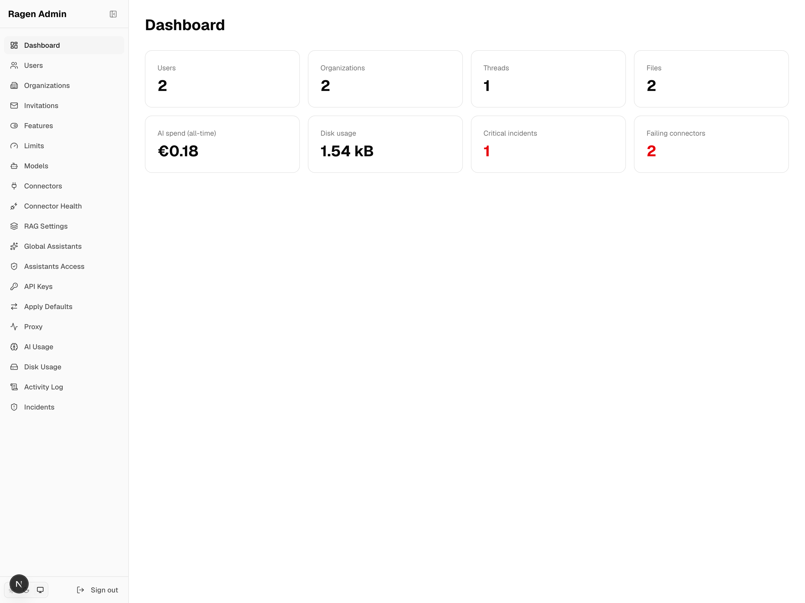
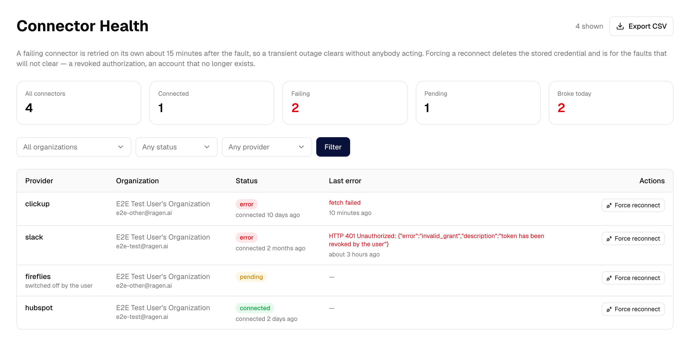

<!-- TODO(logo): centred logo block once we have an SVG in the repo -->

# Ragen AI — Open-Source RAG Platform for Enterprises

**Turn your company documents into an AI assistant that answers from your
data — on your own servers, with your own models.**

*Crafted by hand. Extended by agents.*

<!-- TODO(badges): only valid once the repo is public under the right org.
     Planned: Apache 2.0 · docs.ragen.ai · PRs Welcome · Next.js 16 -->

[Documentation](https://docs.ragen.ai) ·
[Quickstart](https://docs.ragen.ai/docs/quickstart) ·
[API reference](https://docs.ragen.ai/docs/api-reference/chat) ·
[TypeScript SDK](https://www.npmjs.com/package/@ragenai/sdk) ·
[Security review](docs/security-and-privacy.md) ·
[Self-hosting](https://docs.ragen.ai/docs/self-hosting)
<!-- TODO(cta): live demo + community link — see open questions -->

Built and maintained by **[Web Amigos](https://webamigos.pl)**.

---

## The problem

Most "chat with your documents" tools land in one of two places. Either they are
a demo — naive top-k cosine search over a pile of PDFs, confidently wrong the
moment a question needs more than one document — or they are a SaaS product you
hand your contracts, personnel files and client data to, on someone else's
infrastructure, under someone else's retention policy.

Ragen is neither. It is an open-source RAG platform for enterprises that you
run yourself: retrieval that has been measured rather than assumed, access
control enforced where it actually matters, and a model layer you can point
at your own hardware.

## Why Ragen

**Permissions are enforced at retrieval, not in the UI.** A document a user
cannot open cannot appear in an answer, or in a citation, or in the context sent
to the model. Every chunk carries an `accessible_by` filter applied at query
time. Most tools filter the file list and pass everything to the prompt.

**Retrieval that was measured, not assumed.** Hybrid dense + BM25 sparse search
with server-side RRF, multi-query expansion, document summaries generated at
ingest, and cross-encoder reranking over the result set. Four composed
techniques — the first three on by default, reranking once you give it a
provider — each with an ADR recording what it changed and what it cost:
[ADR-14](docs/adrs/14-hybrid-search-dense-sparse.md),
[ADR-15](docs/adrs/15-multi-query-expansion.md),
[ADR-16](docs/adrs/16-document-summaries-at-ingest.md),
[ADR-12](docs/adrs/12-cohere-rerank-post-retrieval.md). Retrieval quality,
rephrasing and red-team behaviour all have eval datasets you can run yourself:
[`apps/web/evals`](apps/web/evals).

**Your infrastructure, your keys.** Documents, database, vector index and
encryption keys stay where you put them. No component reports back to us, and
there is no hosted tier we would rather sell you.
[docs/security-and-privacy.md](docs/security-and-privacy.md) sets out exactly
what leaves your network under which configuration — including the two cases
where the honest answer is "it depends how you set it up".

**No lock-in on the model.** Every model call goes through a LiteLLM proxy that
you also run. Scaleway, Azure OpenAI, AWS Bedrock, Google Vertex, OpenRouter, or
a model on your own GPU — changing provider is a config file, not a migration.

**Multi-tenancy is structural.** One Qdrant collection per organization, a
tenant-scope guard in the Prisma layer that flags any query missing its org
filter, and two deliberately separate role hierarchies. It was designed in, not
retrofitted.

**Drop-in API.** An OpenAI-compatible REST API and an official TypeScript SDK
(`@ragenai/sdk`) with streaming, typed responses and upload helpers. Most
existing clients work by changing the base URL.

## Crafted by hand. Extended by agents.

Ragen was not generated. Two years and 3,200 commits of hand-written
architecture came first — the tenant-scope guard, the retrieval permission
model, the CQRS feature modules, the shared contracts package. Thirty-four ADRs
record what was rejected and why.

Only then did the agent harness go on top: `AGENTS.md` as the canonical brief,
five repo-specific skills for the operations that actually go wrong here
(tenant-scope audits, RAG changes with measurement, e2e triage, dependency
upgrades), and architecture tests that fail the build when a rule is broken
rather than trusting a comment to hold it.

That order is the point. An agent working in this repository is not inventing
conventions — it is following ones that survived production. The entries in
[`docs/lessons/`](docs/lessons/) are the incidents that taught us which
guardrails had to be executable.

**What that buys you:** your team's AI coding agent is useful here on day one,
because the invariants it has to respect are written down, linked, and enforced
by CI instead of living in someone's head.

## What people build with it

- **Internal knowledge base** — onboarding, procedures, contracts and project
  history, answerable in chat, with each answer citing the document it came from
- **Customer-facing chatbot** — an embeddable widget grounded in your public
  documentation, with a separate assistant configuration and its own limits
- **RAG behind your own product** — the OpenAI-compatible API and SDK as the
  retrieval layer of an application you are already building
- **Regulated document sets** — where the answer to "who could have read this?"
  has to be provable, and the documents cannot leave your infrastructure
- **An assistant wired into your tools** — Google Workspace, Slack, HubSpot,
  ClickUp and more over MCP, so the model can read live systems mid-conversation
  rather than only what was indexed last night

## Screenshots

<!-- TODO(screenshots): the chat and knowledge-base captures do not exist yet.
     `apps/docs/screenshots/capture.mts` only covers apps/admin — extend it to
     apps/web against the same demo state, then add them above the admin shot. -->

The platform admin panel — one installation, every organization in it:



Connector health, showing which MCP integrations are failing and why:



Every page of the panel is documented, with screenshots regenerated from a
scripted demo state rather than captured by hand:
[Admin panel](apps/docs/docs/admin-panel.md).

## How it compares

|  | Hosted "chat with your docs" | Your own LangChain stack | **Ragen** |
|---|---|---|---|
| Where your documents live | Vendor's cloud | Yours | **Yours** |
| Choice of model | Vendor's shortlist | Anything | **Anything LiteLLM supports** |
| Access control | Usually per workspace | Whatever you build | **Per file and folder, enforced at retrieval** |
| Multi-tenant | Per seat, per workspace | Whatever you build | **Built in — org-scoped data and index** |
| Retrieval quality | Opaque | Yours to tune, and to debug | **Hybrid + rerank + multi-query, ADR per decision** |
| Time to a working answer | Minutes | Weeks | **Minutes — one command, plus your own model keys** |
| Cost shape | Per seat, forever | Your engineers' time | **Your infrastructure + model spend** |
| When it breaks | Support ticket | You | **You, with the source and the ADRs** |

Fair warning on the middle column: if your requirements are genuinely unusual,
building it yourself is a legitimate answer. Ragen is the better trade when you
want those decisions already made — and documented — rather than made by you.

## Quick start

```bash
npm run ragen:up:everything
```

Builds and starts every Ragen application — web, API, ingest worker, admin —
alongside Postgres, Qdrant, Temporal, LiteLLM, Docling and Redis. No Node
toolchain on the host, which makes it the fastest way to evaluate a self-hosted
install.

Then open <http://localhost:3000>, upload a document, and ask it something.

### Requirements

| | Evaluating | Small production install |
|---|---|---|
| CPU | 4 cores | 4+ cores |
| RAM | 8 GB available to Docker | 16 GB |
| Disk | 25 GB | 100 GB SSD, growing with your documents |
| Docker | >= 24.0, Compose >= v2.26 | same |
| GPU | **not needed** | **not needed** |

**No GPU, unless you want one.** Chat, embeddings and reranking all leave
through the LiteLLM proxy, so the machine running Ragen does no model
inference of its own. Point LiteLLM at a hosted provider and a laptop is
enough. A GPU only enters the picture if you decide to serve models yourself,
which is supported and is a separate box.

**Where the memory actually goes.** Measured on an idle stack, backing services
only:

| Service | Idle memory | Needed for |
|---|---|---|
| Presidio analyzer | 959 MB | PII masking (optional) |
| Docling | 721 MB | local document parsing |
| LiteLLM | 560 MB | every model call |
| Temporal | 97 MB | async ingest |
| Postgres | 93 MB | everything |
| Presidio anonymizer | 55 MB | PII masking (optional) |
| Qdrant | 43 MB | retrieval — grows with your index |
| LiteLLM's Postgres, Temporal UI | 38 MB | the two supporting containers |
| **Total** | **~2.6 GB** | |

Two of those are optional and together account for a gigabyte: drop Presidio if
you are not masking PII, and `DOCUMENT_PARSER=legacy` skips Docling. Qdrant is
the line that moves as you add documents — the figure above is a near-empty
index, so size that one against your own corpus rather than against this table.
Redis is optional and only used for rate limiting. The four applications run on
top of all this and are not in the table.

`npm run ragen:up:app` runs a smaller set — Postgres, Qdrant and LiteLLM, no
document processing — when you only want to try the chat. Sizing guidance for
larger installs is in
[Self-hosting](https://docs.ragen.ai/docs/self-hosting).

For development, `npm run ragen:up:full` runs the dependencies in containers and
leaves the apps running from source with hot reload. Full instructions:
[Self-hosting](https://docs.ragen.ai/docs/self-hosting) ·
[Local development](AGENTS.md#local-development).

## Features

**Retrieval**
Hybrid dense + BM25 sparse search over Qdrant · multi-query expansion ·
ingest-time document summaries · cross-encoder reranking (opt-in, needs a
provider) · citations on every answer · per-organization vector collections

**Knowledge base**
Nested folders · per-user file ownership · sharing with users and teams ·
document versions with diff and rollback · re-indexing on content change ·
RAG optimization suggestions you review before accepting

**Documents**
PDF, DOCX, XLSX, CSV, EPUB, SRT, Markdown, plain text, images and URLs ·
local parsing with Docling by default · async ingest on Temporal, so a large
upload does not block anything

**Integrations (MCP)**
Client and server both · Google Workspace, Gmail, Slack, HubSpot, ClickUp,
Fireflies, WooCommerce · four auth styles including OAuth with PKCE · OAuth
tokens held in a separate vault service, never in the application database ·
a Ragen assistant is also *itself* callable as an MCP tool (`apps/mcp`) by
external clients like Claude Desktop or Cursor, authenticated with the same
API key as the REST API

**API and SDK**
OpenAI-compatible REST API · official TypeScript SDK · opaque API keys ·
streaming over SSE · embeddable chatbot widget

**Security**
Opt-in AES-256-GCM envelope encryption, one key per conversation · optional PII
masking via Presidio · audit log with before-and-after state · tenant-scope
guard over ~20 models · no training on your documents, ever

**Operations**
Platform admin app · per-organization model allowlists and usage limits ·
OpenTelemetry traces, metrics and logs · UI in 15 languages — English,
Polish, Spanish, German, French, Portuguese, Italian, Hungarian, Bulgarian,
Ukrainian, Danish, Swedish, Finnish, Czech and Slovak

## How it works

**Ingest** — a file lands in storage, and a Temporal workflow takes over:
parse, chunk with a splitter chosen for the file type, generate a summary of
the whole document, prepend that summary as its own chunk, embed densely and
sparsely, upsert into the organization's Qdrant collection. It runs
asynchronously, so a 400-page PDF does not block anything.

```
upload → parse → chunk → summarize → hybrid embed → Qdrant
```

**Retrieval** — a question is first rewritten into a standalone one using the
conversation so far, then expanded into an alternative phrasing. Both run as
hybrid searches in parallel; Qdrant fuses dense and sparse results server-side
with RRF; the union is deduplicated and, when a rerank provider is configured,
passed to a cross-encoder before the model sees it, with citation prompting on
top.

```
question → standalone → +1 variant → 2× hybrid search → RRF → dedupe → rerank → answer
```

Hybrid search is not a toggle — it is the schema collections are created with,
so it is always on. Reranking is: it needs `FEATURE_FLAG_RERANKING=1` and a
provider's credentials, and is skipped without them. Every stage degrades
rather than fails — a reranker error falls back to the raw vector order, an
expansion error falls back to a single query. Tuning constants and flag names:
[docs/rag-pipeline.md](docs/rag-pipeline.md).

## Security and privacy

Ragen is self-hosted. Documents, database, index and encryption keys stay on
infrastructure you control, and nothing reports back to the vendor. Whether
document *content* leaves your network during processing depends on how you
configure the model backend — which is a real decision, not a detail, and the
document below treats it as one.

**[docs/security-and-privacy.md](docs/security-and-privacy.md)** answers the
questions that come up in a security review: where data lives, what leaves the
network, encryption, access control, audit logging, and whether documents are
used for training. Every claim points at the code or the ADR behind it, and
says plainly where something is configuration-dependent or not yet built.

Two things worth knowing before you deploy:

- **Parsing is local by default, but it falls back.** `DOCUMENT_PARSER=docling`
  parses on your own hardware; if Docling fails, the worker falls back to
  loaders that send PDFs to an external model. Set `DOCLING_STRICT=1` to fail
  instead of falling back.
- **Encryption at rest is opt-in.** With no key provider configured, Ragen
  starts normally and stores message content unencrypted — convenient locally,
  wrong in production. Set `ENCRYPTION_PROVIDER`.

We would rather tell you this here than have you find it during an audit.

## Open core

Ragen is licensed under [Apache 2.0](LICENSE). The rule for what that covers is
deliberately mechanical: **if a directory contains its own `LICENSE` file, that
file governs everything under it. Everything else is Apache 2.0.** No per-file
headers, no allowlists, no exceptions you have to go looking for. Commercial
paths today: **none** — the entire repository is Apache 2.0.

Three commitments constrain what may ever change:

- **Security is not an upsell.** Tenant isolation, encryption at rest, PII
  masking and access control are core and stay core. Charging extra for the
  mechanisms that give you control over your own data would undercut the point
  of the product.
- **The core never degrades because the commercial layer is absent.** Ragen runs
  without Stripe, without Presidio, without a telemetry backend and without AWS
  KMS. An install with no commercial licence is a complete Ragen, not a
  crippled one.
- **Multi-tenancy is core.** Organization scoping runs through the data model,
  the vector store and the access-control layer. It could not be withheld
  without dismantling the architecture, and it will not become a paid tier.

Full text, including how this affects contributions:
[docs/open-core-boundary.md](docs/open-core-boundary.md).

## Architecture at a glance

An npm-workspaces monorepo on Turborepo. Six applications and eight packages
share one Prisma schema.

| Application | What it is |
|---|---|
| [`apps/web`](apps/web) | The Next.js app — chat, knowledge base, projects, settings |
| [`apps/api`](apps/api) | NestJS public API, the OpenAI-compatible surface |
| [`apps/worker`](apps/worker) | Temporal worker: ingest, embedding, re-indexing |
| [`apps/admin`](apps/admin) | Platform admin — organizations, models, limits, usage |
| [`apps/docs`](apps/docs) | The Docusaurus documentation site |
| [`apps/mcp`](apps/mcp) | MCP server exposing Ragen's own chat to external MCP clients (Claude Desktop, Cursor) |

| Package | Shared by |
|---|---|
| `rag-core` | vector and embedding contracts — web, api, worker |
| `platform-contracts` | values every app must resolve identically: model catalogue, feature flags, connector metadata, tenant-scope model map |
| `storage` | file storage providers — local by default, S3-compatible opt-in |
| `litellm-client`, `vault-client`, `observability`, `db`, `eslint-config` | the remaining cross-app wiring |

Supporting services — LiteLLM, Docling, Presidio, the OTel collector — live in
[`infra/`](infra/README.md), each with its own deployment config.

The full picture — routing, auth, the settings and admin surfaces, the feature
modules, the connector registry — is in [docs/architecture.md](docs/architecture.md).
What each companion service is and how to run the set locally:
[docs/companion-services.md](docs/companion-services.md).

Thirty-four [ADRs](docs/adrs/) record the decisions and what was rejected.
Start with [ADR-21](docs/adrs/21-monorepo-and-api-decoupling.md) for the
monorepo shape and [ADR-33](docs/adrs/33-shared-platform-contracts-package.md)
for why shared values live in one package.

## Documentation

| | |
|---|---|
| [Quickstart](https://docs.ragen.ai/docs/quickstart) | First install, first document, first question |
| [Self-hosting](https://docs.ragen.ai/docs/self-hosting) | Deployment, sizing, configuration |
| [Concepts](https://docs.ragen.ai/docs/concepts) | Assistants, knowledge bases, projects, organizations |
| [API reference](https://docs.ragen.ai/docs/api-reference/chat) | The public API, endpoint by endpoint |
| [Security](docs/security-and-privacy.md) | The document to hand a security reviewer |
| [ADRs](docs/adrs/) | Why the architecture is the way it is |
| [AGENTS.md](AGENTS.md) | The contributor and coding-agent brief |

Deeper reference, in `docs/`:
[architecture](docs/architecture.md) ·
[RAG pipeline](docs/rag-pipeline.md) ·
[knowledge base](docs/knowledge-base.md) ·
[document versioning](docs/document-versioning.md) ·
[document processing](docs/document-processing.md) ·
[vector store](docs/vector-store.md) ·
[MCP integrations](docs/mcp-integrations.md) ·
[token vault](docs/token-vault.md) ·
[file storage](docs/file-storage.md) ·
[companion services](docs/companion-services.md) ·
[model routing](docs/model-routing.md) ·
[event bus](docs/event-bus.md) ·
[thread encryption](docs/thread-encryption.md) ·
[tenant-scope guard](docs/tenant-scope-guard.md) ·
[testing conventions](docs/testing-conventions.md) ·
[lessons](docs/lessons.md)

## Contributing

Pull requests are welcome on everything under Apache 2.0. Start with
[CONTRIBUTING.md](CONTRIBUTING.md), and read [AGENTS.md](AGENTS.md) before your
first change — it is the canonical brief for both humans and coding agents, and
it will save you a review round. Security issues go through
[SECURITY.md](SECURITY.md), not the public tracker.

<!-- TODO(community): Discord or Discussions link, once we have one -->

## License

[Apache 2.0](LICENSE). See [Open core](#open-core) for the boundary rule.

## About

Ragen is built and maintained by **[Web Amigos](https://webamigos.pl)**, an IT
company in Poland. We build it because our own clients needed it and would not
put their documents in someone else's cloud.

Commercial support, deployment help and enterprise terms:
[info@ragen.ai](mailto:info@ragen.ai).
