# Admin panel

A second application, on its own port, for the person who runs the
installation rather than the people who use it. Written for someone deciding
whether it covers what they need to operate Ragen — where something is not
built, or is deliberately absent, this page says so.

The panel administers the whole installation, so there is no public copy of
it to try — it runs on your own deployment, reachable by the accounts you make
platform administrators. The app it administers is at
[demo.ragen.ai](https://demo.ragen.ai).

## Who it is for, and what it is not

Ragen has two administrative surfaces, split by **scope** rather than by
subject:

|                       | Where                                | Who reaches it                            | Answers                                                               |
| --------------------- | ------------------------------------ | ----------------------------------------- | --------------------------------------------------------------------- |
| Organization settings | the main app, under **Organization** | that organization's own owners and admins | "how much does _my_ organization use", "here is _my_ API key"         |
| Admin panel           | a separate app on port `3200`        | anyone with `User.role = 'admin'`         | "how much does this _installation_ use", "revoke somebody else's key" |

So the panel is not a superset of the app. Issuing an API key for your own
integration is routine work for whoever owns the integration; revoking one
that belongs to somebody else is incident response by an operator. Both exist,
and neither is the other's duplicate.

If you run one installation for several client organizations — an agency, an
implementation partner — the panel is where you see all of them at once, and
each client still sees only itself. The boundary is enforced by different
guards, not by different URLs.

## Getting in

The panel authenticates against the same `users` table as the main app, so
there is no second set of accounts. A session alone is not enough: the
dashboard layout re-reads `User.role` **from the database** on every request,
which means revoking the role or banning the account takes effect immediately
rather than when a session expires.

1. Create the first account as described in
   [Self-hosting → The first account](/docs/self-hosting#the-first-account).
   That account is the platform administrator.
2. Open `http://localhost:3200` and sign in with the same e-mail and password.
3. Grant the role to anyone else from **Users** in the panel.

Google sign-in is optional. When it is configured,
`ADMIN_ALLOWED_EMAIL_DOMAIN` restricts which e-mail domain may create a _new_
account through it; set it empty to allow any, since access is decided by the
role anyway.


## Organizations

Every organization on the installation, and a detail page per organization
holding its members, settings, subscription, usage and recent audit entries.

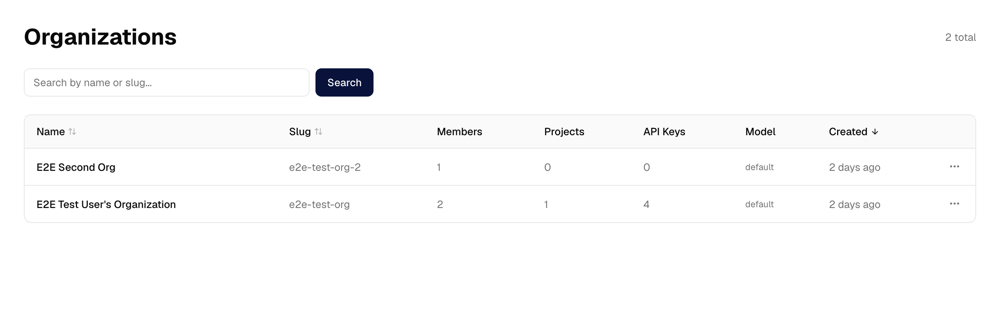

Membership is managed here: add somebody who already has an account, change
their organization role, remove them. Two refusals are deliberate and cannot
be clicked past:

- the **last owner** of an organization cannot be removed or demoted;
- the account must already exist — the panel does not create accounts.

Adding a member also joins them to every LiteLLM team the organization has, so
their model usage is attributed to the right budget rather than falling
outside it.

## Users and the platform role

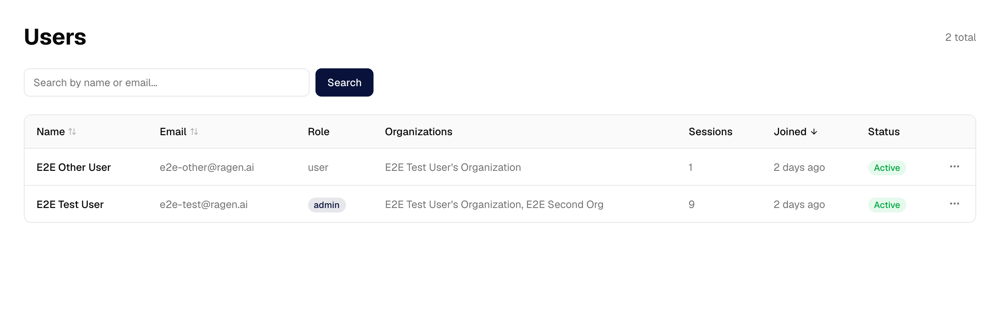

Rename, ban and unban an account, and grant or revoke the platform role.
Banning also revokes that account's sessions, so it takes effect on the next
request rather than whenever the session would have expired.

Two guards protect access to the panel itself: you cannot revoke your own
role, and you cannot revoke the last remaining administrator's. The second is
enforced with a locking read inside a transaction — two administrators
demoting each other at the same moment would otherwise both succeed and lock
everybody out.

## Features

A feature flag is answered by the first of four layers that sets it:

```
organization override  →  plan  →  platform default  →  built-in default
```

The **platform default** is the layer an operator wants. Without it the only
thing above the built-in constant was the subscription plan, so an
installation that manages no plans could only answer "is API access on here"
by setting an override on each organization one at a time.

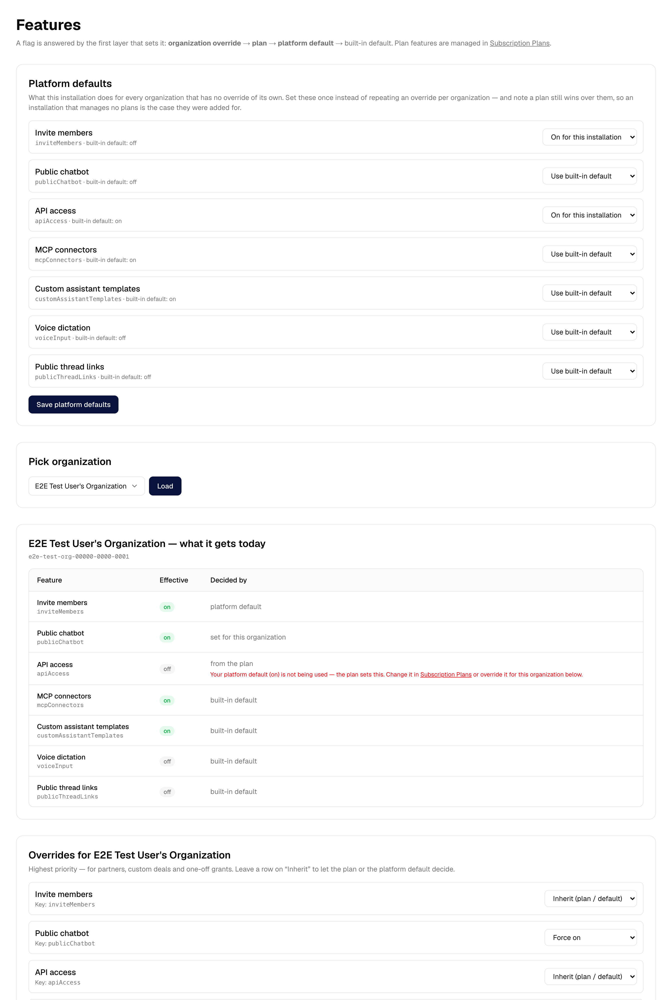

The page also reports what each feature _evaluates_ to for a chosen
organization, and which layer decided it. That matters more than it sounds: an
override that is doing real work and one being shadowed by a plan look
identical from a form that only shows the override. When a plan is overruling
a platform default the row says so, and points at where to change it.

## Limits, models, RAG settings, and applying them

Storage ceilings, monthly token and cost caps, member caps, which models an
organization may use, and the RAG pipeline switches — each editable per
organization and as a platform default.

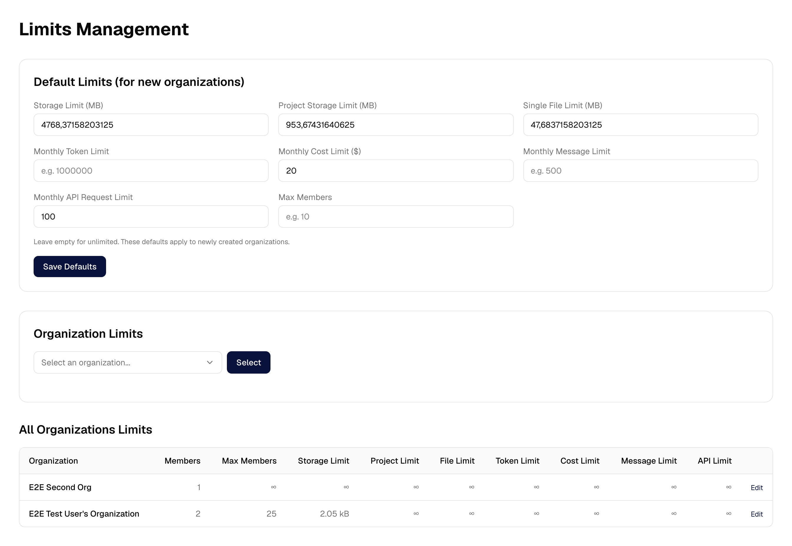

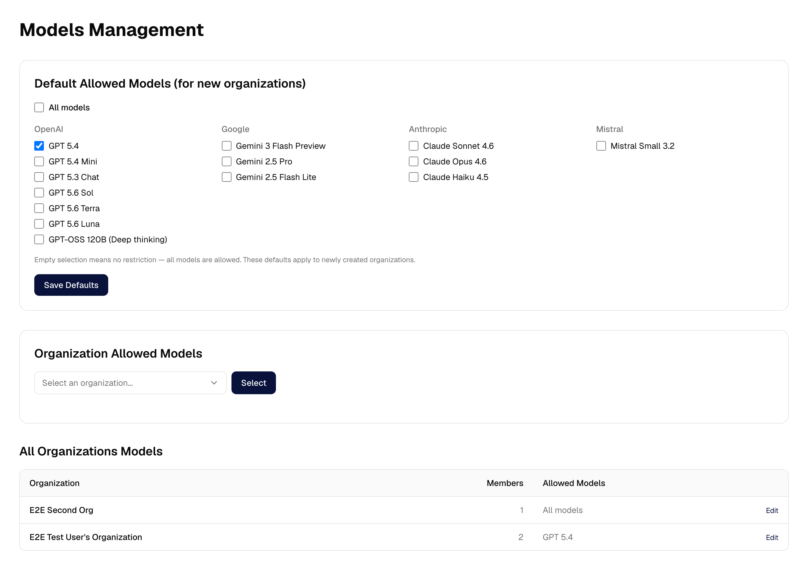

A default is copied into an organization **when the organization is created,
and never again**. So a default edited afterwards reached only the
organizations created since. **Apply Defaults** fixes that, and shows exactly
what would move before it moves anything:

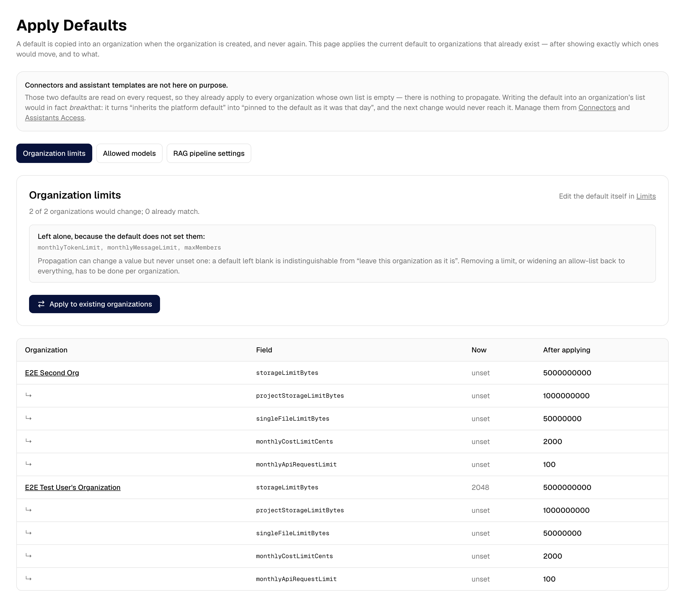

Two things this page is careful about, because both were invisible before it
existed:

- **It cannot clear a value.** A default left blank cannot be told apart from
  "leave this organization alone", so propagation raises and lowers values but
  never removes them. The fields it will skip are listed, by name.
- **Connectors and assistant templates are absent on purpose.** Those two
  defaults are read on every request, so they already apply to every
  organization whose own list is empty. Writing one into an organization's
  list would _break_ that — it turns "inherits the default" into "pinned to
  the default as it was that day".

## API keys

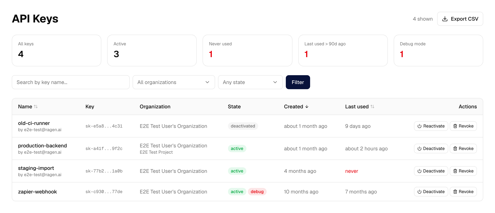

Every key on the installation, with the organization and project it belongs
to, who created it, whether debug mode is on, and **when it was last used**.
That last column is the reason to open the page: a key nobody has ever called
is the one worth withdrawing.

Two separate controls, because they are not the same decision:

|                | What it does                                                                    | Reversible               |
| -------------- | ------------------------------------------------------------------------------- | ------------------------ |
| **Deactivate** | clears `isActive`; the key stops authenticating immediately                     | yes — the secret is kept |
| **Revoke**     | deactivates, then deletes the secret from the token vault, then deletes the row | no                       |

The secret itself lives in ragen-token-vault, not in Postgres, so revoking
needs `RAGEN_TOKEN_VAULT_URL` and `RAGEN_TOKEN_VAULT_SERVICE_SECRET`
configured on the panel. Without them the page still lists keys and still
deactivates them — and says why Revoke is unavailable. If the vault cannot be
reached mid-revoke, the key is left deactivated with its row intact and the
panel tells you the secret survived, rather than deleting the only record of
it.

## Connector health


Which MCP connectors are failing, why, and how long ago.

Before this existed a connector whose token had expired or whose server was
down stayed marked `CONNECTED`: the customer's settings page showed it as
healthy and their assistant simply stopped having those tools. Nothing
anywhere recorded the reason. Now the failure is written down — and the
customer sees it too, on their own connectors page, with the reason and a
prompt to reconnect.

A failing connector is retried automatically about fifteen minutes after the
fault, so a transient outage clears without anybody acting. **Force
reconnect** is for the faults that will not clear — a revoked authorization,
an account that no longer exists. It deletes the stored credential, so the
user is asked to connect again. If the credential cannot be deleted, nothing
is deleted and the panel says so; an operator forcing a disconnect is usually
doing it _because_ the credential is suspect, and a half-done job would be
worse than none.

## Proxy

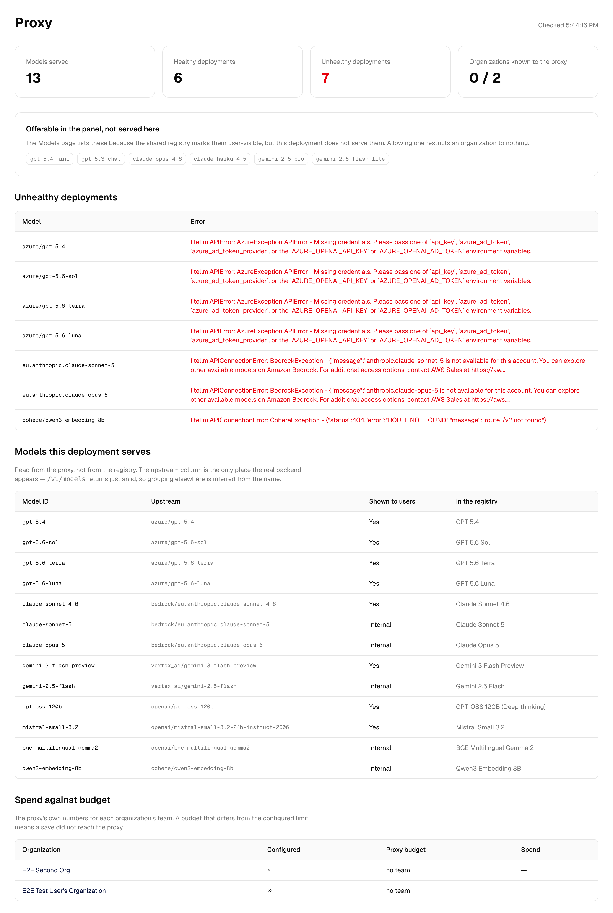

What the LiteLLM proxy actually knows, as opposed to what Ragen believes about
it: healthy and unhealthy deployments with the provider's own error text,
which models this installation really serves and what backend each resolves
to, and per-organization spend against budget with the disagreements marked.

This is the page for "the chat says the model is unavailable". Without the
master key configured it degrades to what `/v1/models` alone can report, and
says so rather than showing zeros.

## Usage

**AI Usage** is every model call across the installation — organization, user,
step, provider, model, tokens and estimated cost — filterable by organization
and period.

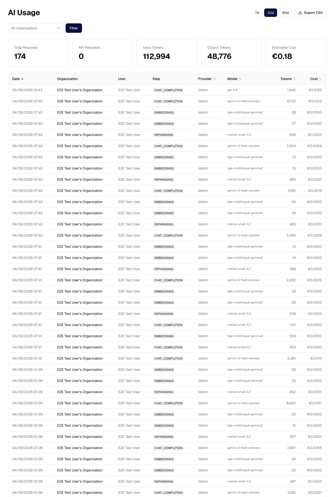

**Disk Usage** is storage per organization against each one's ceiling.

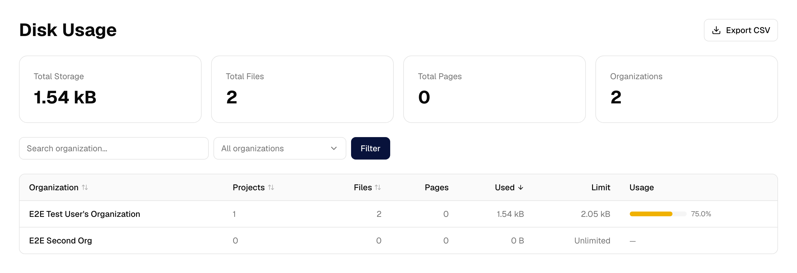

Storage figures come from the same shared arithmetic the customer-facing
storage page uses, so the two cannot report different totals for the same
files. The AI-usage totals share their field selection and their
null-handling; the customer-facing dashboard still builds its own charts on
top, which is presentation rather than arithmetic.

## Activity log and incidents

Every mutating action in the panel is recorded: who did it, to what, and the
before and after values. Sensitive fields are redacted on the way in, so a
masked API key or a token never lands in the log.

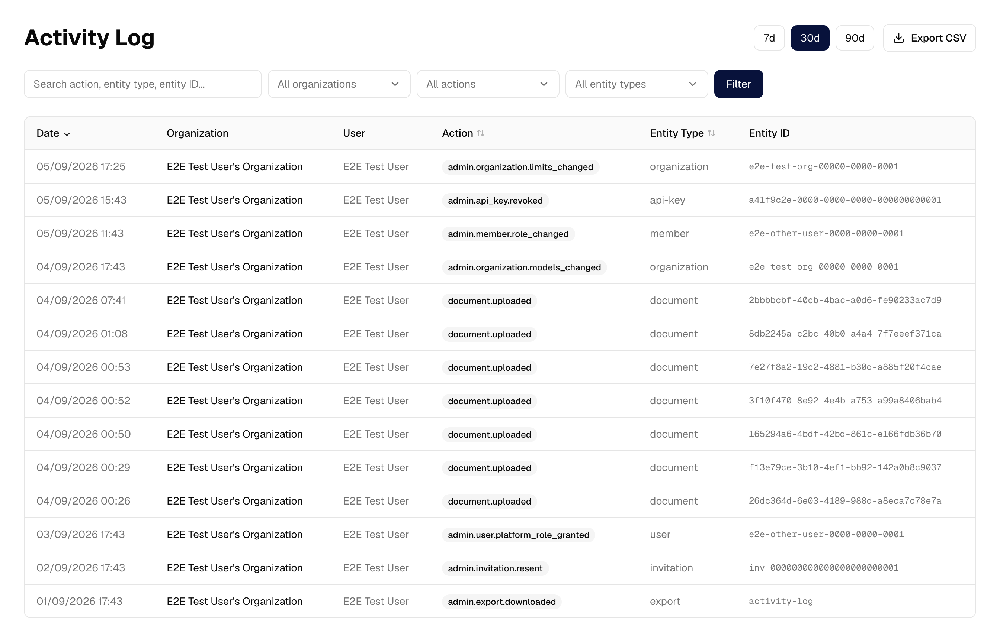

Where an entry goes depends on the action's scope, not on who performed it.
An action belonging to one organization is written to that organization's
audit log — which is where a customer asking "why did my limit change" will
look. An action belonging to the platform, such as granting the platform role,
is written as a security event instead.

**Incidents** is the security-event view: failed sign-ins, brute-force
suspicion, revoked credentials, connector authorization failures, rate limits.
Events can be resolved, and that is recorded too.

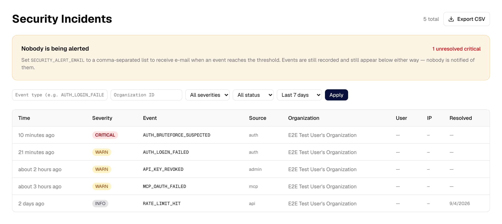

E-mail alerting exists and is off unless configured. `SECURITY_ALERT_SEVERITY`
sets the threshold, defaulting to `critical`; alerts are de-duplicated over
fifteen minutes and capped per hour.

## Export

Activity log, AI usage, disk usage, API keys, connectors and incidents each
export to CSV, honouring the filters currently on screen rather than dumping
the whole table.

Cells are neutralised against formula injection, so a value beginning `=` or
`@` cannot execute when the file is opened in a spreadsheet. The API-key
export deliberately omits the masked value: it is a redacted field in the
audit trail, and exporting it would undo that.

Downloading an export is itself recorded — it is how a large amount of
customer data leaves the system in one click.

## What the panel deliberately cannot do

**Read anybody's conversations.** The panel has no message viewer and no
impersonation control. It was considered and rejected: an operator does not
need to read customer messages to run the platform. Thread content is
encrypted per organization, and the panel holds no path to decrypt it.

That is enforced, not just unbuilt. The main app loads Better Auth's `admin`
plugin, which ships an impersonate endpoint at
`POST /api/auth/admin/impersonate-user`; removing the button would have left
it answering for any account holding the platform role. The plugin has no
"disable" switch, so the platform role is defined without the
`user: ["impersonate"]` permission its route authorizes on — see
`platformAdminAc` in `apps/web/src/lib/auth-access-control.ts`. Banning, role
changes and session revocation are unaffected.

The banner that would warn a user they are being impersonated, and the control
that ends such a session, are deliberately kept. They cost nothing and remain
the way out of any session created before this was closed.

**Create accounts.** The panel grants roles and manages membership; the
account has to exist first.

**Undo a propagation.** Applying a default writes customer-visible settings
and there is no revert — which is why the preview shows every change before
anything is written.

## For contributors

The panel is `apps/admin`, a Next.js application sharing the database and the
Prisma schema with the main app. The scope rule above is enforced by
convention and by tests rather than by structure, so it is worth knowing
before adding a page:

- a **read** is per-organization in `apps/web` and installation-wide in
  `apps/admin`;
- a **write** that acts on an organization from outside it belongs only in
  `apps/admin`, and it records an audit entry.

An architecture test asserts the second half: every exported Server Action in
the panel must call the auth guard as its first statement, and every mutating
one must record an audit entry. An action whose name matches neither the
mutating nor the read-only verb list fails the suite rather than being
silently exempt.

The reasoning behind the split is recorded in the repository as
`docs/adrs/35-two-admin-surfaces-split-by-scope.md`. The screenshots on this
page are regenerated by `apps/docs/screenshots/capture.mts`, against the demo
state in `apps/docs/screenshots/demo-data.sql`.
