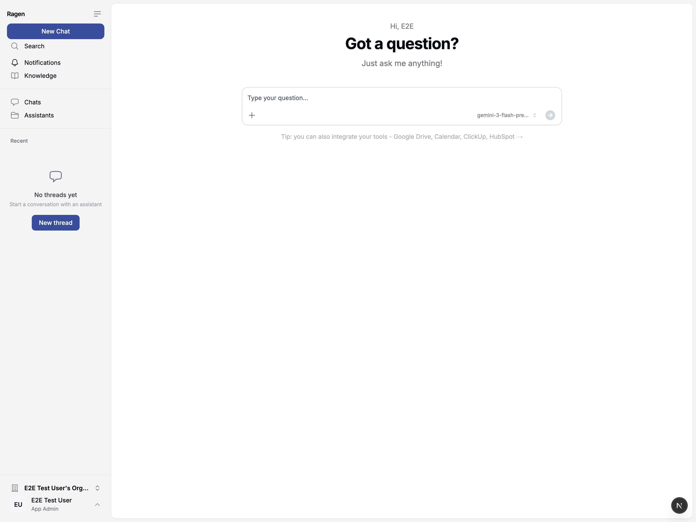

# Introduction

Ragen AI turns your company documents into an AI-powered knowledge base your
team and customers can ask questions of, and get answers grounded in your actual
data rather than invented.

**Ragen is self-hosted.** You run it on your own infrastructure: your documents,
your database, your vector index, your encryption keys. There is no hosted
offering to sign up for, and no component reports back to us. That is the point
of the product, not a limitation of it.

:::tip Try it before you install it
A demo instance is open at [demo.ragen.ai](https://demo.ragen.ai), seeded with
sample data rather than anyone's real documents.

It is there to show what a Ragen installation looks like. It is not a hosted
offering — your own data belongs on your own instance. The admin panel is the
operator's surface, so it runs only on your own deployment; see
[Admin panel](/docs/admin-panel) for what it covers.
:::

## What is Ragen?

Ragen connects your existing documents (PDF, DOCX, PPTX, XLSX, CSV, Markdown,
images, URLs and more) to modern language models, using **Retrieval Augmented
Generation (RAG)** so answers cite the documents they came from.

### Key capabilities

- **AI chat assistant** – internal knowledge platform for your team, with
  permissions enforced at retrieval rather than in the UI
- **AI chatbot** – customer-facing widget you can embed on your website
- **OpenAI-compatible REST API** – the same wire format as OpenAI's, so most
  existing clients work by changing the base URL
- **Official TypeScript SDK** –
  [`@webamigos/ragen-sdk-ts`](https://www.npmjs.com/package/@webamigos/ragen-sdk-ts):
  typed responses, streaming, file upload helpers and automatic retries, for
  Node, edge runtimes and the browser

## Models

Every model call goes through a **LiteLLM proxy that you also run**, which is
what makes the model layer swappable. Point it at models served on your own
hardware and nothing leaves your network; point it at a commercial API and the
prompt — the question plus any retrieved document content needed to answer
it — does, handled from there under that provider's own retention and
training policies.

Which models are available is a deployment decision made in
`litellm/config.yaml`, not something an API consumer chooses per request. Ragen
can route to Scaleway, Azure OpenAI, AWS Bedrock and Google Vertex AI, and to
anything else LiteLLM supports.

## Integrations

Ragen connects to tools your team already uses, over MCP:

- **Google Drive** – import documents and folders into knowledge bases
- **Google Calendar** – let the assistant check availability
- **Google Analytics** – query traffic and conversion data in chat
- **Gmail** – search and read mail through the assistant
- **HubSpot** – CRM data, contacts and deals
- **ClickUp** – tasks, lists and projects
- **Slack** – search messages, post updates, manage channels

## Security

The short version, with the detail in [Security and privacy](/docs/security):

- **Encryption at rest** – opt-in AES-256-GCM envelope encryption (requires
  setting `ENCRYPTION_PROVIDER`), one key per conversation, master key held in
  your own key provider
- **Permissions enforced at retrieval** – content a user cannot open cannot
  appear in an answer or a citation, not just in a file list
- **Tenant isolation** – organization scoping through the data model, one vector
  collection per organization
- **Audit and security logs** – with before-and-after state on administrative
  actions
- **No internal training pipeline** – Ragen never uses your documents to train
  or fine-tune a model; if you route to a commercial API, that provider's own
  policies govern data you submit to them

## Deployment

| Option            | What it means                                                                                                                                          |
| ----------------- | ------------------------------------------------------------------------------------------------------------------------------------------------------ |
| **Self-hosted**   | The default and only supported model. Docker Compose or Kubernetes on infrastructure you control. See [Self-hosting](/docs/self-hosting).              |
| **Private cloud** | The same thing, in your own cloud account (AWS, Azure, GCP, Scaleway). Nothing about the software changes.                                             |
| **Air-gapped**    | Supported by the architecture, but real work rather than a configuration flag. See [Self-hosting](/docs/self-hosting#running-without-internet-access). |

## Next steps

- [**Self-hosting**](/docs/self-hosting) – get an instance running
- [**Quickstart**](/docs/quickstart) – your first API call against it
- [**Security and privacy**](/docs/security) – the questions a security review asks
- [**Chat Completions**](/docs/api-reference/chat-completions) – the recommended
  endpoint for new integrations
- [**Files**](/docs/api-reference/files), [**Assistants**](/docs/api-reference/assistants),
  [**Threads & Messages**](/docs/api-reference/threads) – full API reference
