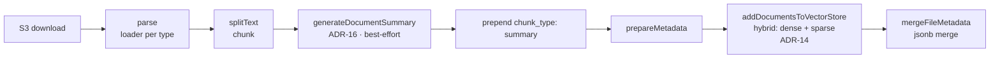

# Ragen Worker

Temporal worker for the Ragen AI platform. Processes document parsing, text chunking, **document summary generation**, **hybrid embedding generation** (dense + BM25 sparse), thumbnail creation, and website scraping tasks.

Implements two retrieval-quality decisions documented in the repo's ADRs:
- [ADR-14](https://github.com/webamigos/ragenai/blob/main/docs/adrs/14-hybrid-search-dense-sparse.md) — hybrid dense + BM25 sparse vectors with RRF fusion
- [ADR-16](https://github.com/webamigos/ragenai/blob/main/docs/adrs/16-document-summaries-at-ingest.md) — ingest-time document summaries written as synthetic chunks + `UserFile.metadata.summary`

## Quick Start

**Dev mode:**

```bash
npm run dev
```

**Production mode:**

```bash
npm run build
npm run start
```

**Docker:**

```bash
docker build -t ragen-worker .
docker run ragen-worker
```

The project is configured for deployment on [Railway](https://railway.app) via `railway.toml`.

## Commands

| Command | Purpose |
|---------|---------|
| `npm run dev` | Start worker in watch mode (tsx) |
| `npm run build` | Compile TypeScript to `dist/` |
| `npm run start` | Build then run compiled worker |
| `npm run test` | Run Jest test suite |
| `npm run test:watch` | Run Jest in watch mode |
| `npm run lint` | Run ESLint |

Run a single test file: `npx jest --config ./jest.config.ts path/to/test.ts`

## Architecture

### Temporal Workflow System

The worker connects to a Temporal server and listens on the `ragen-tasks` queue. It has two main workflows:

- **`runFileEmbeddings`** (`src/workflows/parse-and-embed.ts`) - Main pipeline: S3 download → parse → chunk → generate summary → prepend summary chunk → hybrid embed (dense + sparse) → store in Qdrant → merge `UserFile.metadata.summary`
- **`scrapeWebsite`** (`src/workflows/scrape-website.ts`) - Scrape website via FireCrawl → create document → generate embeddings → store in Qdrant

**`runFileEmbeddings` flow:**



The summary step is best-effort — feature-flag off, empty input, LLM errors, and Temporal-level failures all degrade to "no summary" without failing the workflow. `mergeFileMetadata` runs outside the embedding try-catch so a DB error cannot falsely mark embedding as FAILED.

Workflows support cancellation via the `cancelEmbedding` signal and state queries via `embeddingState`.

### Activities (`src/activities/`)

Activities are the executable units within workflows, grouped by domain:

- `ai-usage/` - Embedding usage reporting
- `api-keys/` - API key retrieval and management
- `aws/` - S3 file download/upload
- `db/` - PostgreSQL operations. Includes `mergeFileMetadata` (ADR-16) for JSONB `||` merges that preserve existing metadata keys (e.g. Google Drive import fields)
- `documents/` - Document record creation + `generateDocumentSummary` (ADR-16, best-effort summary via `SUMMARY_MODEL`)
- `embeddings/` - Embedding preparation and metadata
- `files/` - File type detection (binary check, MIME type)
- `loaders/` - Document parsing (PDF, EPUB, DOCX, SRT, text, CSV, XLSX, image, website via FireCrawl)
- `meilisearch/` - Vector storage (Qdrant by default with hybrid dense+sparse per ADR-14, Meilisearch for legacy orgs)
- `notifications/` - Pusher real-time notifications
- `splitters/` - Text chunking with type-specific settings
- `thumbnails/` - Thumbnail generation (PDF, image, text preview) and S3 upload

### Services (`src/services/`)

Core infrastructure layer:

- **`llm/`** - Vercel AI SDK provider setup: `getChatModel()`, `getChatModelForOrg()`, `getEmbeddingModel()` with optional OpenRouter support
- **`chains/`** - LLM chains (e.g., PDF RAG processing)
- **`text-splitters/`** - Custom text splitting (RecursiveCharacterTextSplitter, MarkdownTextSplitter)
- **`db/`** - Knex-based PostgreSQL queries
- **`document-loaders/`** - Custom document loader implementations (PDF via Claude native/vision, SRT, CSV, XLSX via SheetJS, image via vision LLM, website via FireCrawl, buffer)
- **`notifications/`** - Pusher notification service
- **`qdrant.ts`** - Qdrant client for vector storage (default). Writes hybrid named vectors per ADR-14: `dense` (Cohere 1024-dim) + `sparse` (BM25 term frequencies with Qdrant's server-side `idf` modifier)
- **`bm25-encoder.ts`** - Pure-TS BM25 sparse vector encoder. The single source of truth now lives in `@ragenai/rag-core` (`packages/rag-core/src/bm25-encoder.ts`), shared with apps/web and apps/api
- **`meilisearch.ts`** - Meilisearch client for vector storage (legacy, dense-only)
- **`redis.ts`** - Redis singleton for caching organization settings
- **`aws.ts`** - S3 client configuration
- **`langfuse-trace.ts`** - Langfuse tracing integration
- **`logger.ts`** - Pino logger with OpenTelemetry bridge
- **`otel-logger.ts`** - OpenTelemetry log emitter

### Observability

- **OpenTelemetry** (`src/instrument.ts`) - Traces, metrics, and logs export via OTLP
- **Langfuse** - LLM call tracing and monitoring
- **Pino** - Structured logging with OTel bridge

## Working with Temporal

### Important Constraints

- **Activities must return plain objects** - methods/functions are lost during serialization
- **Use string names for workflows in production** - passing workflow functions works in dev but breaks in prod due to different build artifacts
- **After renaming an activity**, Temporal Cloud may still reference the old name; create a new workflow name instead
- **Only one worker instance** should run with a given build at a time

### Starting workflows from other services

```ts
const workflow = await getTemporalClient().workflow.getHandle(WORKFLOW_ID);

// Send signal to cancel embedding
await workflow.signal('cancelEmbedding');

// Query embedding state
const embeddingState = await workflow.query('embeddingState');
```

Use **string names** for workflows in production:

```ts
// Correct
const handle = await client.workflow.start('runFileEmbeddings', {
  taskQueue: 'ragen-tasks',
  workflowId: id,
  args: [input],
});

// Wrong - will break in prod
import { runFileEmbeddings } from './workflows';
const handle = await client.workflow.start(runFileEmbeddings, { ... });
```

## Running Locally

### Prerequisites

- Node.js >= 20
- Copy `.env.example` for local setup
- Temporal dev server or Temporal Cloud credentials

### Using Temporal Dev Server (recommended)

Install and start the [Temporal CLI dev server](https://learn.temporal.io/getting_started/typescript/dev_environment/#set-up-a-local-temporal-service-for-development-with-temporal-cli):

```bash
temporal server start-dev
```

Then start the worker:

```bash
npm run dev
```

### Using Temporal Cloud

Provide the following env vars:

```
TEMPORAL_SERVER_ADDRESS=
TEMPORAL_NAMESPACE=
TEMPORAL_CERT=
TEMPORAL_KEY=
```

## Docker

The project uses a multi-stage Dockerfile (Node 24-slim) with separate stages for dependencies, build, and runtime. The final image runs as a non-root `worker` user.

```bash
docker build -t ragen-worker .
docker run ragen-worker
```

## Tech Stack

- **Temporal** for workflow orchestration
- **Vercel AI SDK** (`ai`, `@ai-sdk/openai`, `@ai-sdk/anthropic`) for embeddings, LLM calls, and Claude native PDF processing
- **Knex** + PostgreSQL for persistence
- **Qdrant** (`@qdrant/js-client-rest`) for vector storage (default)
- **Meilisearch** for vector storage (legacy)
- **Redis** (ioredis) for caching
- **AWS S3** for document storage
- **SheetJS** (`xlsx`) for CSV/Excel file parsing
- **Sharp** + **resvg-js** for image/thumbnail processing
- **Langfuse** for LLM observability
- **OpenTelemetry** for traces, metrics, and logs
- **Pino** for structured logging
- **Pusher** for real-time notifications
- **Zod** for environment variable validation

## Environment Variables

Key env vars:
- **Infrastructure**: `TEMPORAL_SERVER_ADDRESS`, `DATABASE_URL`, `REDIS_URL`, `QDRANT_URL`, `QDRANT_API_KEY`, `MEILISEARCH_URL` (legacy), `AWS_*` credentials, `PUSHER_*`, `FIRECRAWL_API_KEY`
- **LLM**: `LITELLM_PROXY_URL`, `LITELLM_MASTER_KEY`
- **PDF**: `PDF_PROCESSOR` (`claude` default or `vision`), `PDF_MODEL` (defaults to `claude-haiku-4-5`)
- **Summaries (ADR-16)**: `SUMMARY_MODEL` (default `gemini-2.5-flash`), `FEATURE_FLAG_DOC_SUMMARIES` (default on — set `0` or `false` to disable summary generation)

Optional: `LANGFUSE_*` keys (set on LiteLLM container), `OTEL_EXPORTER_OTLP_ENDPOINT`.

> **Note:** `OPENAI_API_KEY` and `ENABLE_OPENROUTER` were removed in the LiteLLM integration. All LLM calls now route through the LiteLLM proxy — configure provider keys in `infra/litellm/config.yaml`.

Full schema in `src/validateEnvVars.ts`.
