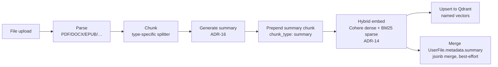
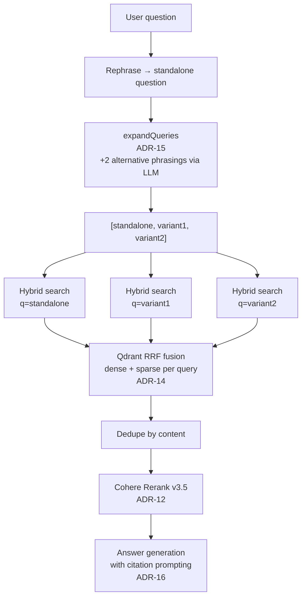
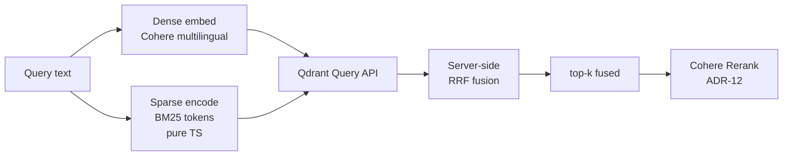

# RAG Pipeline Diagrams

Visual reference for the retrieval-quality stack. See ADRs 11, 12, 14, 15, 16 for decision history, and `AGENTS.md` for the concise prose summary.

## Ingest flow (in `apps/worker`)

## Retrieval flow (in `apps/web`, `src/libs/chains/basic-rag/`)

## Vector store query (Qdrant hybrid)

## How the four improvements compose

| ADR | Pipeline stage | Problem it solves |
|-----|---------------|-------------------|
| **ADR-12** Cohere Rerank | After retrieval | Sharpens top-k by cross-encoder precision |
| **ADR-14** Hybrid search | At retrieval | Exact-term + morphological matches that dense alone misses |
| **ADR-15** Multi-query | Before retrieval | Vocabulary mismatch between user phrasing and document phrasing |
| **ADR-16** Summaries | At ingest | Per-document topic anchors that no flat chunk contains |

ADR-14/15/16 widen the candidate pool; ADR-12 sharpens it. All four are gated behind env flags that default to on.

## Configuration and defaults

Moved here from `AGENTS.md`, which was holding the only copy of these while
every sibling RAG section had already been reduced to a pointer. The
instruction budget is 32,768 bytes and content past it never reaches the
agent, so operational detail belongs on this side of the pointer.

| ADR | Stage | What it does |
|---|---|---|
| **14** Hybrid search | Retrieval | Dense (`bge-multilingual-gemma2`) + sparse (BM25) with server-side RRF |
| **15** Multi-query | Before retrieval | Expands to N-1 alternative phrasings via `REPHRASE_MODEL`; the standalone question is always first |
| **16** Summaries | Ingest | The worker prepends one summary chunk (`metadata.chunk_type: 'summary'`) per document |
| **12** Rerank | After retrieval | Cross-encoder sharpens top-k (Scaleway `qwen3-embedding-8b` by default) |

**Ingest** (`apps/worker`): parse → chunk → summarize → prepend summary chunk
→ hybrid embed → upsert to Qdrant (named vectors), plus a best-effort merge
into `UserFile.metadata.summary`.

**Retrieval** (`apps/web/src/libs/chains/basic-rag/`): rephrase to standalone →
`expandQueries()` → parallel hybrid searches → dedupe by content → rerank →
answer generation with citation prompting.

- **Multi-query**: `MULTI_QUERY_VARIANT_COUNT = 2`, so three queries in total.
  Per-query `k` is divided so the reranker's input stays bounded. Any error
  falls back to a single query rather than failing the request.
- **Reranker**: over-retrieves 3x and falls back to the raw vector results on
  a provider error. `RERANK_PROVIDER` selects the backend — unset (the
  default) uses Scaleway `/v1/rerank` with `qwen3-embedding-8b`; `cohere` opts
  back into Bedrock Cohere Rerank v3.5 through LiteLLM, which needs AWS
  credentials and `cohere-rerank-v3-5` re-enabled in
  `infra/litellm/config.yaml`.
- **Flags**: `FEATURE_FLAG_MULTI_QUERY`, `FEATURE_FLAG_DOC_SUMMARIES`. Both
  default to on.

