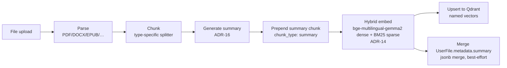
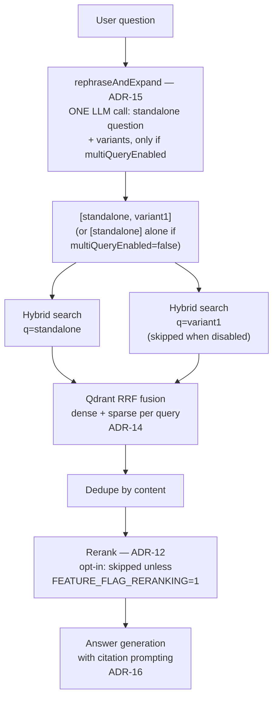
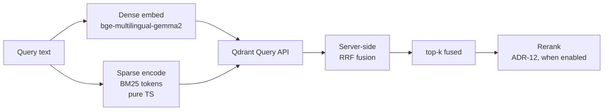

# RAG Pipeline Diagrams

Visual reference for the retrieval-quality stack. See ADRs 11, 12, 14, 15, 16 for decision history, and `AGENTS.md` for the concise prose summary.

## Ingest flow (in `apps/worker`)

## Retrieval flow (in `apps/web`, `src/libs/chains/basic-rag/`)

Shown with multi-query on (the default). With the per-org `multiQueryEnabled`
setting off, `rephraseAndExpand` returns only the standalone question, so `P`
is `[standalone]` and only the `S1` branch runs.

## Vector store query (Qdrant hybrid)

## How the four improvements compose

| ADR | Pipeline stage | Problem it solves |
|-----|---------------|-------------------|
| **ADR-12** Rerank | After retrieval | Sharpens top-k by scoring each query/document pair directly |
| **ADR-14** Hybrid search | At retrieval | Exact-term + morphological matches that dense alone misses |
| **ADR-15** Multi-query | Before retrieval | Vocabulary mismatch between user phrasing and document phrasing |
| **ADR-16** Summaries | At ingest | Per-document topic anchors that no flat chunk contains |

ADR-14/15/16 widen the candidate pool; ADR-12 sharpens it. They are **not**
gated alike, and none of them hangs off a single "default on" env flag:

- **Hybrid search (ADR-14)** is unconditional — it is how the Qdrant collection
  is written and queried, with no toggle.
- **Multi-query (ADR-15)** is a per-organization setting
  (`OrganizationSettings.multiQueryEnabled`, default on). The env flag that
  used to gate it, `FEATURE_FLAG_MULTI_QUERY`, **no longer exists** — it was
  replaced by the setting when the per-org RAG settings landed.
- **Summaries (ADR-16)** are gated in the worker by `FEATURE_FLAG_DOC_SUMMARIES`
  (on unless `0`/`false`).
- **Reranking (ADR-12)** is **opt-in**: it needs `FEATURE_FLAG_RERANKING=1`
  *and* provider credentials, so a default install answers from raw hybrid
  results. The per-org `rerankingEnabled` setting can only turn it further off.

## Configuration and defaults

Moved here from `AGENTS.md`, which was holding the only copy of these while
every sibling RAG section had already been reduced to a pointer. The
instruction budget is 32,768 bytes and content past it never reaches the
agent, so operational detail belongs on this side of the pointer.

| ADR | Stage | What it does |
|---|---|---|
| **14** Hybrid search | Retrieval | Dense (`bge-multilingual-gemma2`) + sparse (BM25) with server-side RRF |
| **15** Multi-query | Before retrieval | Expands to `MULTI_QUERY_VARIANT_COUNT` alternative phrasings via `REPHRASE_MODEL`, in the same call as the rephrase; the standalone question is always first |
| **16** Summaries | Ingest | The worker prepends one summary chunk (`metadata.chunk_type: 'summary'`) per document |
| **12** Rerank | After retrieval | Re-scores and sharpens top-k. Scaleway `qwen3-embedding-8b` by default (a bi-encoder); `RERANK_PROVIDER=cohere` is the true cross-encoder. Opt-in — see the flags below |

**Ingest** (`apps/worker`): parse → chunk → summarize → prepend summary chunk
→ hybrid embed → upsert to Qdrant (named vectors), plus a best-effort merge
into `UserFile.metadata.summary`.

**Retrieval** (`apps/web/src/libs/chains/basic-rag/`): `rephraseAndExpand()` —
standalone question and, if the org has multi-query on, variants in one LLM
call → parallel hybrid searches → dedupe by content → rerank, if enabled →
answer generation with citation prompting.

- **Multi-query**: when the per-org `multiQueryEnabled` setting is on (the
  default), `MULTI_QUERY_VARIANT_COUNT = 1`, so two queries per turn — the
  standalone question plus one alternative phrasing. It was `2` (three
  queries) until the pipeline-speedup pass, which also merged the rephrase and
  the expansion into one `generateObject()` call (`rephraseAndExpand()`), so a
  turn costs one LLM round-trip rather than two. Per-query `k` is divided so
  the reranker's input stays bounded. Any error — or the setting being off —
  falls back to the standalone question alone rather than failing the request.
- **Reranker** (when enabled): over-retrieves 3x and falls back to the fused
  hybrid results on a provider error. `RERANK_PROVIDER` selects the backend —
  unset (the default) uses Scaleway `/v1/rerank` with `qwen3-embedding-8b`;
  `cohere` opts back into Bedrock Cohere Rerank v3.5 through LiteLLM, which
  needs AWS credentials and `cohere-rerank-v3-5` re-enabled in
  `infra/litellm/config.yaml`.
- **Flags**:
  - `FEATURE_FLAG_RERANKING` — **off** unless set to `1`, and reranking also
    needs provider credentials: `SCW_API_BASE` + `SCW_API_KEY` for Scaleway
    (the default), or for `cohere` — AWS credentials with the `bedrock:Rerank`
    IAM permission (see the `BedrockRerank` statement in
    [`docs/aws-iam-policy.json`](aws-iam-policy.json)), and
    `cohere-rerank-v3-5` uncommented in `infra/litellm/config.yaml`
    (commented out today). Both halves are checked in `isRerankingEnabled()`,
    so the default install reranks nothing.
  - `FEATURE_FLAG_DOC_SUMMARIES` — on unless `0`/`false`. Read by the worker
    activity, so ingest-time summaries are on by default.
  - There is **no** `FEATURE_FLAG_MULTI_QUERY`. Any doc still listing it is
    stale; the gate is the per-org setting below.
- **Per-org settings** (`OrganizationSettings`, all default on, editable at
  `/organization/rag-settings` and in the admin panel):
  `multiQueryEnabled` and `rerankingEnabled` are read by the chain;
  `contentModerationEnabled` only applies when `IS_ON_PREMISE` is set (SaaS
  always moderates); `docSummariesEnabled` is **not read by the worker yet**, so
  turning it off does not currently stop summary generation.

