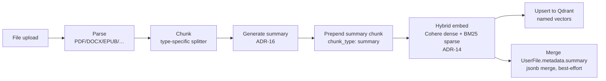
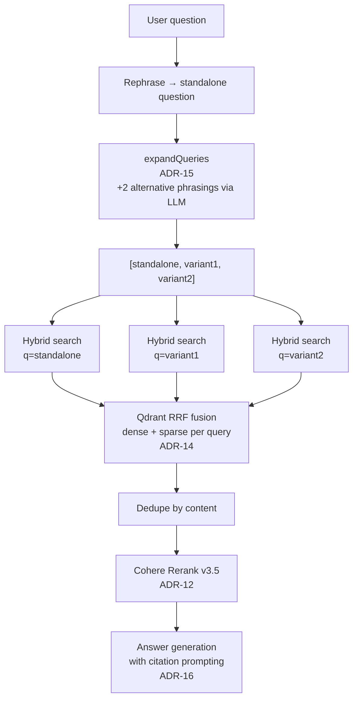
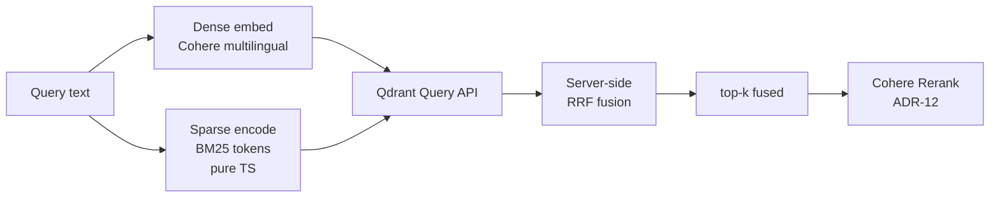

# RAG Pipeline Diagrams

Visual reference for the retrieval-quality stack. See ADRs 11, 12, 14, 15, 16 for decision history, and `AGENTS.md` for the concise prose summary.

## Ingest flow (in `ragen-worker`)

## Retrieval flow (in `ragen-app`, `src/libs/chains/basic-rag/`)

## Vector store query (Qdrant hybrid)

## How the four improvements compose

| ADR | Pipeline stage | Problem it solves |
|-----|---------------|-------------------|
| **ADR-12** Cohere Rerank | After retrieval | Sharpens top-k by cross-encoder precision |
| **ADR-14** Hybrid search | At retrieval | Exact-term + morphological matches that dense alone misses |
| **ADR-15** Multi-query | Before retrieval | Vocabulary mismatch between user phrasing and document phrasing |
| **ADR-16** Summaries | At ingest | Per-document topic anchors that no flat chunk contains |

ADR-14/15/16 widen the candidate pool; ADR-12 sharpens it. All four are gated behind env flags that default to on.
