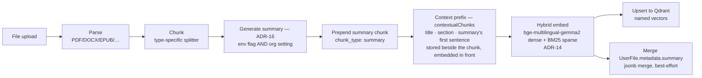
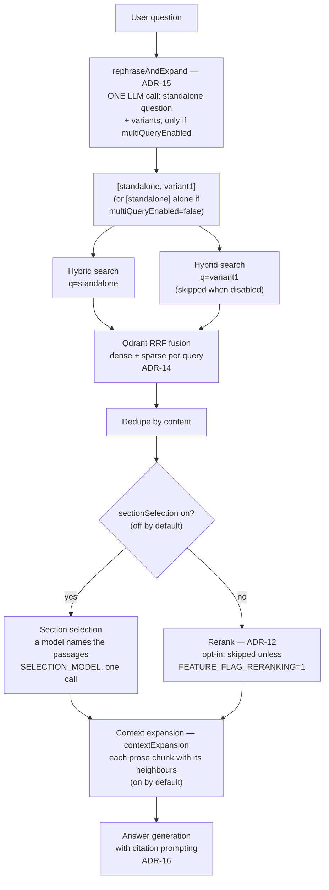
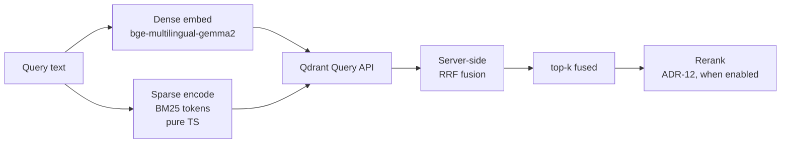

# RAG Pipeline Diagrams

Visual reference for the retrieval-quality stack. See ADRs 11, 12, 14, 15, 16 for decision history, the 2026-09-29 specs (`contextual-chunks`, `llm-document-selection`) for the three newer stages, and `AGENTS.md` for the concise prose summary.

## Ingest flow (in `apps/worker`)

```mermaid
flowchart LR
    A[File upload] --> B[Parse<br/>PDF/DOCX/EPUB/…]
    B --> C[Chunk<br/>type-specific splitter]
    C --> D["Generate summary — ADR-16<br/>env flag AND org setting"]
    D --> E[Prepend summary chunk<br/>chunk_type: summary]
    E --> X["Context prefix — contextualChunks<br/>title · section · summary's first sentence<br/>stored beside the chunk, embedded in front"]
    X --> F[Hybrid embed<br/>bge-multilingual-gemma2 dense + BM25 sparse<br/>ADR-14]
    F --> G[Upsert to Qdrant<br/>named vectors]
    F --> H[Merge UserFile.metadata.summary<br/>jsonb merge, best-effort]
```

## Retrieval flow (in `apps/web`, `src/libs/chains/basic-rag/`)

```mermaid
flowchart TD
    Q[User question] --> R["rephraseAndExpand — ADR-15<br/>ONE LLM call: standalone question<br/>+ variants, only if multiQueryEnabled"]
    R --> P["[standalone, variant1]<br/>(or [standalone] alone if<br/>multiQueryEnabled=false)"]
    P --> S1[Hybrid search<br/>q=standalone]
    P --> S2["Hybrid search<br/>q=variant1<br/>(skipped when disabled)"]
    S1 --> D1[Qdrant RRF fusion<br/>dense + sparse per query<br/>ADR-14]
    S2 --> D1
    D1 --> U[Dedupe by content]
    U --> SEL{"sectionSelection on?<br/>(off by default)"}
    SEL -- yes --> SS["Section selection<br/>a model names the passages<br/>SELECTION_MODEL, one call"]
    SEL -- no --> RR["Rerank — ADR-12<br/>opt-in: skipped unless<br/>FEATURE_FLAG_RERANKING=1"]
    SS --> CE["Context expansion — contextExpansion<br/>each prose chunk with its neighbours<br/>(on by default)"]
    RR --> CE
    CE --> G[Answer generation<br/>with citation prompting<br/>ADR-16]
```

Shown with multi-query on (the default). With the per-org `multiQueryEnabled`
setting off, `rephraseAndExpand` returns only the standalone question, so `P`
is `[standalone]` and only the `S1` branch runs.

**With neither the reranker nor section selection running — the default
install — the variant's hits do not reach the model.** The lists are
concatenated in query order and cut to `maxDocuments`, which is the first
query's hits. The `crossQueryFusion` feature key (off by default, #1518)
merges the lists by reciprocal rank before the cut instead; the
retrieval-claims spec's Phase B measures it.

## Vector store query (Qdrant hybrid)

```mermaid
flowchart LR
    Q[Query text] --> D[Dense embed<br/>bge-multilingual-gemma2]
    Q --> S[Sparse encode<br/>BM25 tokens<br/>pure TS]
    D --> P[Qdrant Query API]
    S --> P
    P --> RRF[Server-side<br/>RRF fusion]
    RRF --> K[top-k fused]
    K --> C[Rerank<br/>ADR-12, when enabled]
```

## How the stages compose

| Stage | Where | Problem it solves |
|-----|---------------|-------------------|
| **ADR-12** Rerank | After retrieval | Sharpens top-k by scoring each query/document pair directly |
| **ADR-14** Hybrid search | At retrieval | Exact-term + morphological matches that dense alone misses |
| **ADR-15** Multi-query | Before retrieval | Vocabulary mismatch between user phrasing and document phrasing |
| **ADR-16** Summaries | At ingest | Per-document topic anchors that no flat chunk contains |
| **Contextual chunks** | At ingest | A chunk that does not say which document or section it is from |
| **Context expansion** | After retrieval | A hit whose answer continues in the chunk before or after it |
| **Section selection** | After retrieval, in the reranker's slot | Choosing passages by reading them rather than scoring them |

ADR-14/15/16 and contextual chunks widen or sharpen the candidate pool;
ADR-12 or section selection picks from it; context expansion widens what each
pick shows the model. They are **not** gated alike, and none of them hangs off
a single "default on" env flag:

- **Hybrid search (ADR-14)** is unconditional — it is how the Qdrant collection
  is written and queried, with no toggle.
- **Multi-query (ADR-15)** is a per-organization setting
  (`OrganizationSettings.multiQueryEnabled`, default on). The env flag that
  used to gate it, `FEATURE_FLAG_MULTI_QUERY`, **no longer exists** — it was
  replaced by the setting when the per-org RAG settings landed.
- **Summaries (ADR-16)** need both `FEATURE_FLAG_DOC_SUMMARIES` (the
  installation's off switch, on unless `0`/`false`) and the per-org
  `docSummariesEnabled` setting (default on), read by the worker when the job
  runs. Existing summaries stay when either is turned off.
- **Reranking (ADR-12)** is **opt-in**: it needs `FEATURE_FLAG_RERANKING=1`
  *and* provider credentials, so a default install answers from raw hybrid
  results. The per-org `rerankingEnabled` setting can only turn it further off.
  Measured on 2026-10-01 (`evals/rag-benchmark/results/2026-10-01-a3-reranker-baseline.md`):
  no change on prose (`kolej` 17 vs 18 of 24, identical evidence), a gain on
  tables (`tabele` 7/18 off vs 10/17 Scaleway). The reranking arm also
  retrieves a three-times-wider pool, so that gain is not yet attributable to
  the reranker; the retrieval-claims spec's Phase B splits the two before
  anything claims a benefit.
- **Contextual chunks** — feature key `contextualChunks`, **on** by default.
  It changes what is embedded, so only files ingested or re-indexed while it is
  on carry the prefix; `apps/worker/src/scripts/reindex-for-context.ts` brings
  the rest up, and the RAG settings page counts how many are current.
- **Context expansion** — feature key `contextExpansion`, **on** by default.
  It changes only what a turn reads, so it applies to every file at once.
- **Section selection** — feature key `sectionSelection`, **off** by default.
  When on, the reranker does not run; one call per turn on `SELECTION_MODEL`,
  recorded as `SECTION_SELECTION`. Level with the reranker on prose and worse
  on tables in its measurement, so it is an opt-in alternative.

## Configuration and defaults

Moved here from `AGENTS.md`, which was holding the only copy of these while
every sibling RAG section had already been reduced to a pointer. The
instruction budget is 32,768 bytes and content past it never reaches the
agent, so operational detail belongs on this side of the pointer.

| ADR | Stage | What it does |
|---|---|---|
| **14** Hybrid search | Retrieval | Dense (`bge-multilingual-gemma2`) + sparse (BM25) with server-side RRF |
| **15** Multi-query | Before retrieval | Expands to `MULTI_QUERY_VARIANT_COUNT` alternative phrasings via `REPHRASE_MODEL`, in the same call as the rephrase; the standalone question is always first |
| **16** Summaries | Ingest | The worker prepends one summary chunk (`metadata.chunk_type: 'summary'`) per document |
| **12** Rerank | After retrieval | Re-scores and sharpens top-k. Scaleway `qwen3-embedding-8b` by default (a bi-encoder); `RERANK_PROVIDER=cohere` is the true cross-encoder. Opt-in — see the flags below |

**Ingest** (`apps/worker`): parse → chunk → summarize → prepend summary chunk
→ hybrid embed → upsert to Qdrant (named vectors), plus a best-effort merge
into `UserFile.metadata.summary`.

**Retrieval** (`apps/web/src/libs/chains/basic-rag/`): `rephraseAndExpand()` —
standalone question and, if the org has multi-query on, variants in one LLM
call → parallel hybrid searches → dedupe by content → rerank, if enabled →
answer generation with citation prompting. The chain also returns
`retrievedSources` — the files whose chunks were shown to the model. A
`DocumentCitation` row is written only for the subset the answer actually
names (`features/documents/utils/cited-sources.ts`); before that intersection
existed, every retrieved file counted as a citation and the Knowledge Analytics
screen was a retrieval-frequency table.

- **Multi-query**: when the per-org `multiQueryEnabled` setting is on (the
  default), `MULTI_QUERY_VARIANT_COUNT = 1`, so two queries per turn — the
  standalone question plus one alternative phrasing. It was `2` (three
  queries) until the pipeline-speedup pass, which also merged the rephrase and
  the expansion into one `generateObject()` call (`rephraseAndExpand()`), so a
  turn costs one LLM round-trip rather than two. Per-query `k` is divided so
  the reranker's input stays bounded. Any error — or the setting being off —
  falls back to the standalone question alone rather than failing the request.
- **Reranker** (when enabled): over-retrieves 3x and falls back to the fused
  hybrid results on a provider error. `RERANK_PROVIDER` selects the backend —
  unset (the default) uses Scaleway `/v1/rerank` with `qwen3-embedding-8b`;
  `cohere` opts back into Cohere Rerank v3.5, which needs
  `RERANK_COHERE_BASE_URL` pointed at an endpoint speaking Cohere's rerank
  shape and `RERANK_COHERE_API_KEY` to authenticate to it. AWS credentials are
  that endpoint's problem, not the app's, when it is one fronting Bedrock. The
  gateway route table carries no rerank model — `/rerank` is not a chat
  completion, so it never went through `infra/llm-gateway/routes.yaml`.
- **Flags**:
  - `FEATURE_FLAG_RERANKING` — **off** unless set to `1`, and reranking also
    needs provider credentials: `SCW_API_BASE` + `SCW_API_KEY` for Scaleway
    (the default), or for `cohere` — `RERANK_COHERE_BASE_URL` naming an
    endpoint that serves `cohere-rerank-v3-5`, plus `RERANK_COHERE_API_KEY`.
    If that endpoint fronts Bedrock, it in turn needs AWS credentials with the
    `bedrock:Rerank` IAM permission (see the `BedrockRerank` statement in
    [`docs/aws-iam-policy.json`](aws-iam-policy.json)). Both halves are checked
    in `isRerankingEnabled()`, so the default install reranks nothing.
  - `FEATURE_FLAG_DOC_SUMMARIES` — on unless `0`/`false`. Read by the worker
    activity, so ingest-time summaries are on by default.
  - There is **no** `FEATURE_FLAG_MULTI_QUERY`. Any doc still listing it is
    stale; the gate is the per-org setting below.
- **Per-org settings** (`OrganizationSettings`, all default on, shown at
  `/organization/rag-settings` and edited in the admin panel):
  `multiQueryEnabled` and `rerankingEnabled` are read by the chain;
  `docSummariesEnabled` is read by the worker at ingest, beside the env flag;
  `contentModerationEnabled` is **read by nothing** — guardrails replaced the
  moderation call, and what runs is the organization's guardrail rules
  ([`guardrails.md`](guardrails.md)), an empty set being off. The settings
  page shows each row as it runs (`resolveEffectivePipeline`), not the column.
- **Feature keys** (`packages/platform-contracts`, per org in the admin panel →
  Features): `contextualChunks` and `contextExpansion` on, `sectionSelection`
  off, as above.

## Strict grounding: what an answer may draw on

The answer prompt carries one rule for a question the retrieved context does
not answer, and which rule applies is per assistant
(`ProjectSettings.answerFromDocumentsOnly`; spec
`2026-10-03-retrieval-claims-match-the-product-before-launch`, Phase C2):

- **Strict** — "If the context does not contain the answer, say that the
  documents do not cover it, and do not answer from general knowledge."
- **Default** — the model may answer from its own knowledge, saying so.

The column is nullable. `null` means "the surface default": strict when the
assistant has the public chatbot enabled (`Project.chatbotEnabled`), the
default rule otherwise; an admin can set it either way with the switch on the
assistant page. `resolveAnswerFromDocumentsOnly` in
`@ragenai/platform-contracts` is the one resolver, read by the panel chat, the
public assistant page and apps/api's `/chat` and `/chat/completions`, always
by a project id the server already resolved and scoped to the organization.
Three cases keep the default rule: a turn with no assistant (the knowledge
base), a `MODEL_ONLY` turn (there is no context to stay inside, so strict would
refuse everything), and the embedded widget, which is an organization-level
chatbot with no assistant to carry the setting.

Both apps fill `{grounding_rule}` from their own copy of `GROUNDING_RULES`
(`basic-rag/config.ts`), and
`tests/architecture/answer-prompt-rules-agree.test.ts` fails when the two rule
lists differ in either variant. There is no relevance threshold: an RRF score
encodes rank only, so a cut-off on it would look like a guard and not be one.
Whether the prompt rule is enough is measured by the guard corpus (C1/C3).
