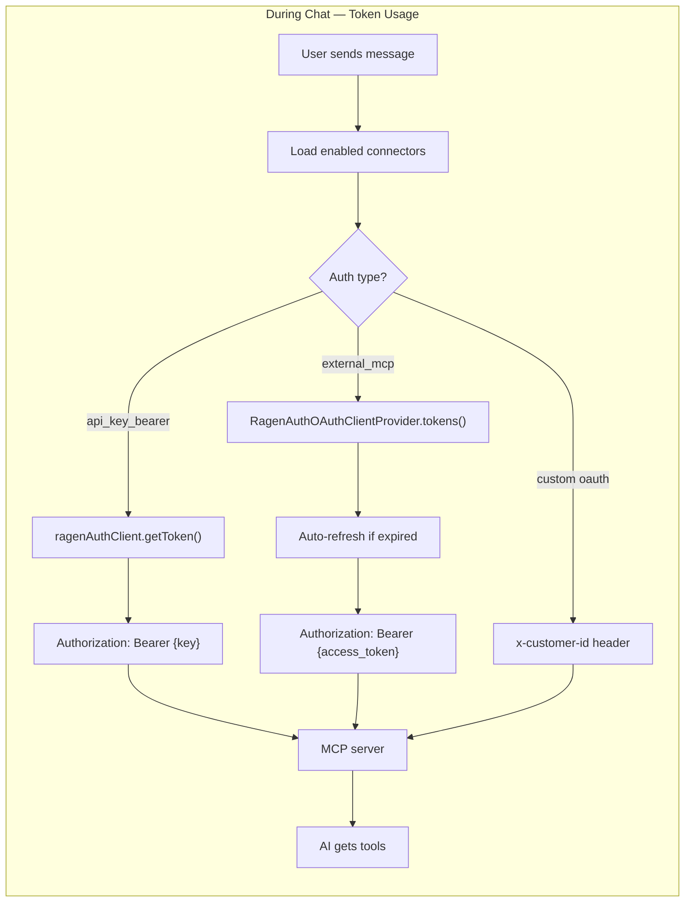

# Token vault

Split out of `README.md` so the README can introduce the product rather than
document it. OAuth tokens and connector API keys live in a separate service. See also [`mcp-integrations.md`](mcp-integrations.md) and [ADR-32](adrs/32-token-vault-and-mcp-stay-separate.md).

OAuth tokens and API keys for external connectors are stored in [ragen-token-vault](https://github.com/WebAmigos/ragen-token-vault) — a centralized token vault with AES-256-GCM encryption. All token operations go through `RagenAuthClient` (`packages/vault-client`, shared by `apps/web` and `apps/api` — see [ADR-32](adrs/32-token-vault-and-mcp-stay-separate.md)) using HMAC-SHA256 service-to-service auth.

### Auth flows

Three auth types are supported for connectors. All store tokens in ragen-token-vault.

```mermaid
flowchart TD
    subgraph "External MCP OAuth (ClickUp, HubSpot)"
        A1[User clicks Connect] --> A2[apps/web creates connector PENDING]
        A2 --> A3["GET /api/connectors/external/connect"]
        A3 --> A4["RagenAuthOAuthClientProvider<br/>saves client info + code verifier<br/>to ragen-token-vault"]
        A4 --> A5[Returns authorization URL]
        A5 --> A6[Browser popup → OAuth provider]
        A6 --> A7[User authorizes]
        A7 --> A8["GET /api/connectors/external/callback"]
        A8 --> A9["mcpAuth() exchanges code → tokens"]
        A9 --> A10["RagenAuthOAuthClientProvider<br/>saves tokens to ragen-token-vault"]
        A10 --> A11[Connector marked CONNECTED]
    end

    subgraph "API Key Bearer (Fireflies)"
        B1[User enters API key] --> B2["registerApiKeyBearerCommand()"]
        B2 --> B3["ragenAuthClient.storeToken()<br/>stores encrypted API key"]
        B3 --> B4[Connector marked CONNECTED]
    end

    subgraph "Custom OAuth (Google Calendar, Drive, Analytics, Ads)"
        C1[User clicks Connect] --> C2["Browser → ragen-connectors /auth/google"]
        C2 --> C3["ragen-connectors → ragen-token-vault<br/>GET /v1/oauth/google/authorize"]
        C3 --> C4[ragen-token-vault generates PKCE + redirects to Google]
        C4 --> C5[User authorizes]
        C5 --> C6["Google → ragen-token-vault /v1/oauth/google/callback"]
        C6 --> C7["ragen-token-vault exchanges code → tokens<br/>encrypts + stores"]
        C7 --> C8[Redirect back to apps/web]
        C8 --> C9[Connector marked CONNECTED]
    end
```

### Key files

| File | Purpose |
|---|---|
| `packages/vault-client/src/client.ts` | `RagenAuthClient` — HMAC-signed HTTP client for the Ragen Token Vault API, shared by `apps/web` and `apps/api` (ADR-32). The `src/libs/ragen-vault/client.ts` in each app is wiring only: it reads that app's env and passes its logger. |
| `apps/web/src/libs/ragen-vault/oauth-provider.ts` | `RagenAuthOAuthClientProvider` — implements `OAuthClientProvider` from `@ai-sdk/mcp` |
| `src/libs/mcp/client.ts` | `createMcpToolsFromConnectors()` — fetches tokens from Ragen Token Vault during chat |
| `src/features/connectors/services/commands/` | Connect/disconnect commands using `ragenAuthClient` |
| `src/app/api/connectors/external/` | OAuth connect + callback routes |

### Conventions

- **Provider names** are UPPERCASE in ragen-token-vault (matches `McpConnectorProvider` Prisma enum: `CLICKUP`, `HUBSPOT`, `FIREFLIES`, `GOOGLE_CALENDAR`, etc.)
- **Customer ID format**: `{orgId}:{userId}:{provider_lowercase}` (e.g. `abc123:user456:clickup`)
- **Environment variables**: `RAGEN_TOKEN_VAULT_URL` and `RAGEN_TOKEN_VAULT_SERVICE_SECRET` (shared secret must match ragen-token-vault config)
